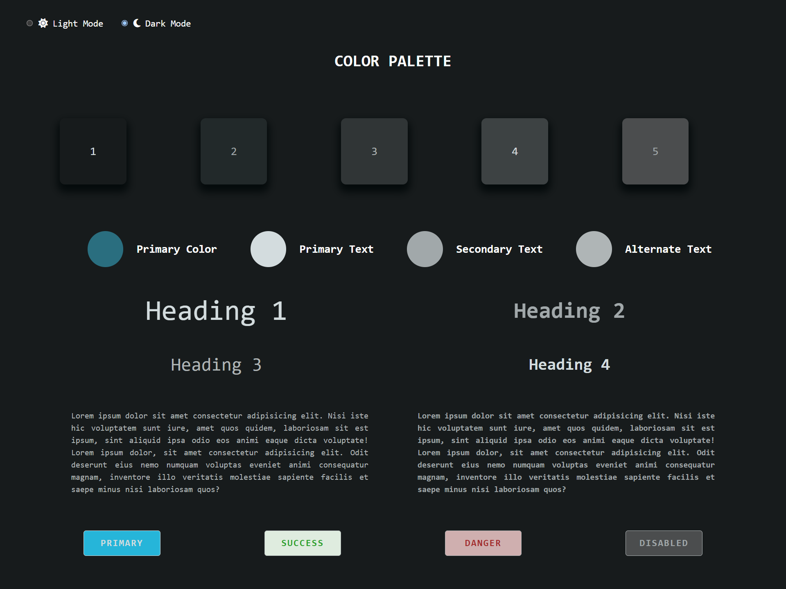

# COLOR PALETTE GENERATOR

In this documentation the code for web application that generates color palette from a single primary color is given. The user will select one primary color of their choice which shows the colors generated from that primary color.
- By default the color palette is set to  #FFFFFF


## CSS Variables
CSS variables plays a major role in designing the color palette from the primary color. To perform this action there are certain steps to be followed, they are :

### 1. Get the primary color
To get the primary color we are using _**Vanilla JS Color Picker**_ . This vanilla JS Color Picker is a simple, easy to use color picker with no dependencies. To access the vanilla JS Color picker we need to import the package.

#### React JS
```
npm install vanilla-picker --save
import Picker from 'vanilla-picker';
```

#### Native Application
```
<script src="https://unpkg.com/vanilla-picker@2"></script>
```
---
To add the color picker in your web page, you just need to import the above code and a few lines of JavaScript to make the color picker work.

##### HTML
```
<div id="parent">Click me</div>
```
##### JavaScript
```
var parent = document.querySelector('#parent');
var picker = new Picker(parent);
picker.onChange = function(color) {
    parent.style.background = color.rgbaString;
};
```

### 2. Converting to Color Code
After importing the color picker, the code color code obtained from the picker should be converted into HSL color code. HSL stands for Hue, Saturation and Light. Hue is used to decide the color 0 (and) 360 represents Red, 120 represents green and 240 represents blue. Saturation is used to define the gray scale of the color, lower the number (0%) greater the gray scale and higher the number (100%) greater the gray scale. Finally, Lightness tell about how much light does the color needs, on average it is 50%, 0% (black) and 100% (white).
To convert the color code from string to HSL value, we use a sey of JavaScript code.
```
// Function to get HSL Value from String
function getHSLValues(hslColor) {
    const startIndex = hslColor.indexOf("(") + 1;
    const endIndex = hslColor.lastIndexOf(")");
    const hslValuesStr = hslColor.substring(startIndex, endIndex);

    [hue, saturation, lightness] = hslValuesStr.split(",").map((value) => parseInt(value.trim(), 10));
    return { hue, saturation, lightness };
}

// Call HSL function
getHSLValues(colorCode);
console.log(hue, saturation, lightness);
```

### 3. CSS Schema for color palette
CSS schema plays a major roe in designing the color palette. With the values of Hue, Saturation and Light, you can control the entire color schema of the primary color. By adjusting the values of saturation and light.

#### CSS SCHEMA
```
--primary-h: 0;
--primary-s: 100%;
--primary-l: 100%;

--primary:           hsl(var(--brand-h) var(--brand-s) var(--brand-l));
--primary-text:      hsl(var(--brand-h) var(--brand-s) 10%);
--secondary1-text:   hsl(var(--brand-h) 30% 30%);
--secondary2-text:   hsl(var(--brand-h) 20% 50%);
--surface1:          hsl(var(--brand-h) 25% 90%);
--surface2:          hsl(var(--brand-h) 20% 99%);
--surface3:          hsl(var(--brand-h) 20% 92%);
--surface4:          hsl(var(--brand-h) 20% 85%);
--surface5:          hsl(var(--brand-h) 10% 70%);
--shadow-surface:    hsl(var(--brand-h) 10% 20%);
--shadow-strength:   0.02;
```
---
---
---

## After Adding HSL and Color picker to the web page


## Light mode for selected color


## Dark mode for the selected color

To change the color from light mode to dark mode, the lightness and saturation of the light mode properties is slightly modified.
By using JavaScript the mode are switched between one another using radio button id's and values.

